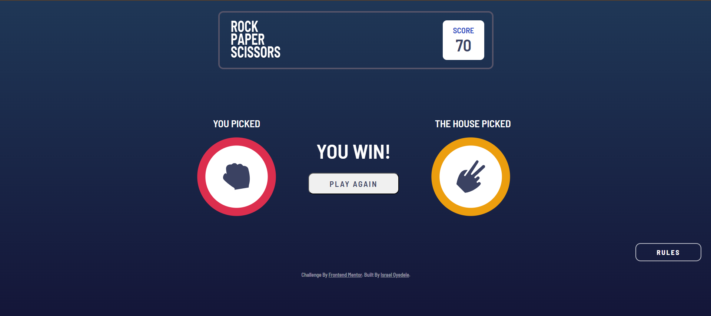

# Frontend Mentor - Rock, Paper, Scissors solution

This is a solution to the [Rock, Paper, Scissors challenge on Frontend Mentor](https://www.frontendmentor.io/challenges/rock-paper-scissors-game-pTgwgvgH). Frontend Mentor challenges help you improve your coding skills by building realistic projects. 

## Table of contents

- [Overview](#overview)
  - [The challenge](#the-challenge)
  - [Screenshot](#screenshot)
  - [Links](#links)
- [My process](#my-process)
  - [Built with](#built-with)
  - [What I learned](#what-i-learned)
  - [Continued development](#continued-development)
  - [AI Collaboration](#ai-collaboration)
- [Author](#author)

**Note: Delete this note and update the table of contents based on what sections you keep.**

## Overview

### The challenge

Users should be able to:

- View the optimal layout for the game depending on their device's screen size
- Play Rock, Paper, Scissors against the computer
- Maintain the state of the score after refreshing the browser _(optional)_
- **Bonus**: Play Rock, Paper, Scissors, Lizard, Spock against the computer _(optional)_

### Screenshot

### Links

- Solution URL: [Rock, Paper, Scissors](https://github.com/Israeloyedele/rock-paper-scissors)
- Live Site URL: [Add live site URL here](https://your-live-site-url.com)

## My process

### Built with

- Semantic HTML5 markup
- CSS custom properties
- Flexbox
- CSS Grid
- Mobile-first workflow
- [React](https://reactjs.org/) - JS library
- [Framer-Motion](https://motion.dev/)

### What I learned

**These are some of the things I learnt while building this project:**

- I learnt how to use Framer with react while building this project

- I also learnt more on conditional rendering and props in react

### Continued development

I want to learn more about using React to the best of my ability then move on to building more projects.

### AI Collaboration

I used ChatGPT when Debugging, add some CSS and Brainstorm Solutions
The CSS worked well, I had to find my bugs myself most of the time.
ChatGPT was helpful overall.

## Author

- Website - [Israel Oyedele](https://github.com/Israeloyedele)
- Frontend Mentor - [@Israeloyedele](https://www.frontendmentor.io/profile/Israeloyedele)

